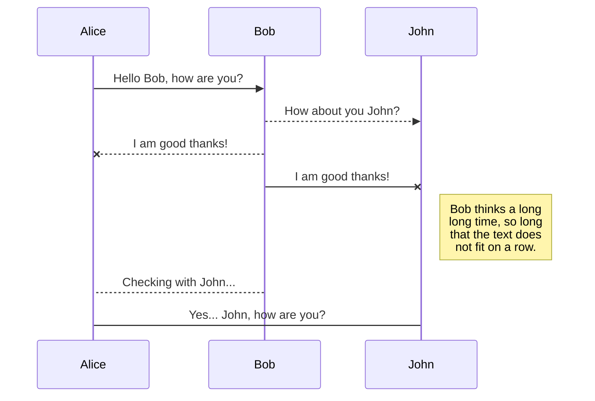
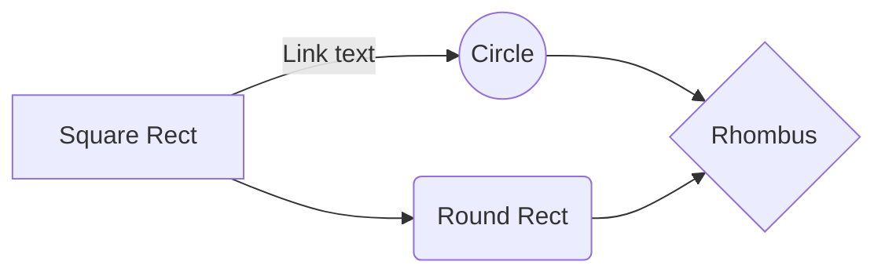

# Regiones Críticas Condicionales

### La programación concurrente consiste en controlar (Al acceder a las Secciones Críticas):

 - **Exclusión Mutua** 
 - **Condición de Sincronización**
 
**Sección Crítica:** Secciones de código donde se accede a recursos visibles por todos los hilos/procesos pero que no pueden ser utilizados por mas de un proceso a la vez.

### Las primitivas básicas en los lenguajes de programación son:

- **Mutex  ( Lock )**
- **Semáforos**
En general, se puede resolver todo con Semáforos, ya que un Mutex se puede implementar con un semáforo binario (inicializado en 1)

Con estas primitivas básicas se pueden resolver problemas de **Exclusión Mútua** y **Condiciones de Sincronización**.

Si se utilizan únicamente estas primitivas, es responsabilidad del programador elegir correctamente las variables y semáforos/mutex que permitan resolver las condiciones de sincronización y situaciones de exclusión mútua.
En programas complejos, esto se torna muy complicado de resolver como así también de depurar errores.
Los semáforos se utilizan de la misma forma para resolver para exclusión mutua y sincronización, por lo que no es fácil determinar que semáforos se utilizan para exclusión mutua y cuales para condiciones de sincronización-

Son necesarios entonces, mecanismos que permitan al programador tratar en forma diferente los problemas de sincronización y el acceso exclusivo a la sección crítica.

**Regiones Críticas Condicionales**:  Son mecanismos estructurados que permiten diferenciar el control de acceso a la sección crítica de la implementación de las condiciones de sincronización.

*Se describen a continuación las estructuras para implementar estos mecanismos utilizando pseudocódigo, que puede traducirse a lenguajes de programación de alto nivel. Se mantienen algunas primitivas en inglés, ya que en algunos lenguajes existen expresiones similares.*

## Recursos

Para asegurar el acceso y uso correcto de las Variables Compartidas, las mismas se declaran de una manera especial, agrupandolas en ***resources*** (recursos).

> **resource** <id_recurso> : var1, var2, var2....

 - Una variable NO puede estar en 2 recursos a la vez
 - Todas las variables compartidas tienen que estar en un recurso.

## Región
Las variables definidas en recursos se tienen que acceder de una forma especial, utilizando la construcción ***region*** (región) 

> **region** <id_recurso> **do** 
> **begin**
> 
> >Operaciones con las variable que pertenecen al recurso **id_recurso** 
> 
> **end**

Ejemplo:

    resource Variables: var1, var2
    
    region Variables do
    begin
    	var1 += 1	
    	var2 = var1 * 5
    end

 - Todo lo que se ejecuta dentro de la región, se ejecuta en **exclusión mutua**.
 - Si un proceso quiere ejecutar una región, y está libre, procede a ejecutarla, si está ocupada, se bloquea y se coloca en la **cola principal**.
 - Hay una cola principal por **recurso**. Si hay n regiones asociadas al mismo recurso, todas los procesos que se bloquean al intentar accederlas se colocan en la cola principal del recurso.
 - Este esquema, sólo resuelve en forma estructurada la **Exclusión Mutua**

## Implementación en Python

En el presente repositorio se encuentran 

Pero de esta forma no resuelve la Condición de Sincronización

Para eso hay que utilizar la Región Crítica con Condicionales

PSEUDOCODIGO

region <id_recurso> with <condicion> do
begin
	operaciones con variables compartidas pertenecientes al recurso id_recurso
end

La condición es un valor BOOLeano, que permite implementar la condición de sincronización

1 - Antes de entrar a la región, el proceso tiene que obtener el acceso con exclusión mutua a la region.
	Si no lo consigue (por que esta ocupada por otro proceso) se bloquea -> Cola Principal

2 - Si obtiene acceso a la región, evalúa la condición:
	- Si es verdadera prosibue con las instruciones de la región.
	- Si es falsa, libera la exclusión mútua de la región y se bloquea en otra cola asociada a la region. COLA DE EVENTOS.
3 - Cuando un proceso termina de ejectuar la región:
	- Primero comprueba si puede desbloquear y ceder la exclusión mutua a alguno de los procesos bloqueados en la COLA DE EVENTOS (región). Reevalua la condición para cada uno de los procesos.
	- Si ningún proceso en la COLA DE EVENTOS puede ser desbloqueado, cede la exclusión mutua al primer proceso que está en la COLA PRINCIPAL.
	- Si no hay procesos en la COLA PRINCIPAL, la región queda liberada esperando otros procesos.

## UML diagrams

You can render UML diagrams using [Mermaid](https://mermaidjs.github.io/). For example, this will produce a sequence diagram:

And this will produce a flow chart:

